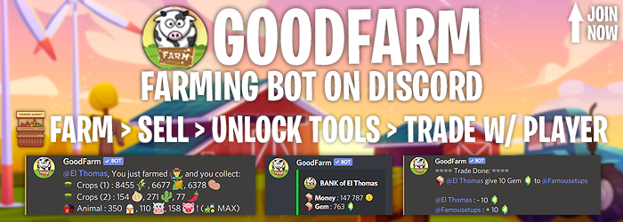

**Made by ElThomas ❤️ in France**

### **➡️ GoodFarm - RPG Discord Bot**
350 servers - +11500 players

Goodfarm is a bot discord RPG, where you mine and farm to collect resources and earn money. There is a system of pickaxe, shovel, generator,... The algorithm is based on an exponential base of tool prices. There is also a system of exchange of resources.

➡️ ``Statistics``: 
26 Commands  
Language: JavaScript  
DataBase: MongoDb  
Version: 2.4  
Prefix: 'g'  
 
Owner: elthomas#2246
 
### Demo Discord

(is currently unavailable)
